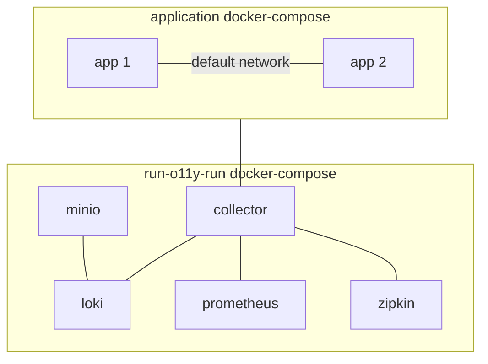

# External Network

In certain scenarios, users may need to integrate their own `docker-compose` configurations with `run-o11y-run`. To facilitate this, we provide support for a multi docker-compose setup.

To utilise this feature, simply run `run-o11y-run` with the `--external-network` flag. This allows you to seamlessly integrate your existing `docker-compose` configurations with `run-o11y-run`, enabling you to leverage the power of both environments in a unified manner.

Here's an example of how you can set up your `docker-compose` configurations to work with `run-o11y-run`:

1. To start `run-o11y-run` with an external bridged `o11y` network, simply run the following command:

```sh
run-o11y-run start --external-network
```

This command initiates `run-o11y-run` and enables seamless integration with your existing infrastructure through the `o11y` network. By using the `--external-network` flag, you establish a bridge between `run-o11y-run` and your custom `docker-compose` configurations.

2. Modify your `docker-compose.yaml` file to include a network definition for the o11y network:

```yaml
networks:
  o11y:
    name: o11y
    driver: bridge
    external: true
```

3. Update the services in your `docker-compose.yaml` file to use the `o11y` network:

```yaml
services:
  foo:
    image: ...
    networks:
      - o11y
    environments:
    - OTEL_EXPORTER_OTLP_ENDPOINT: otel-collector:431...

  bar:
    image: ...
    networks:
      - o11y
    environemnts:
    - OTEL_EXPORTER_OTLP_ENDPOINT: otel-collector:431...
```

By connecting your customer-managed `docker-compose` setup with `run-o11y-run` assets through the `o11y` network, you establish communication between your applications and the observability components provided by `run-o11y-run`.

> Note: run-o11y-run provides [pcm](./patch-compose.md) command which automates patching customer owned docker-compose with some predefined setup.

## Network flow

Here's a visual representation of the network flow:



This diagram illustrates how your application services (`app1` and `app2`) can communicate with the observability components provided by `run-o11y-run` through the `o11y` network.

You can refer to the example file provided [here](docker-compose.yaml).
