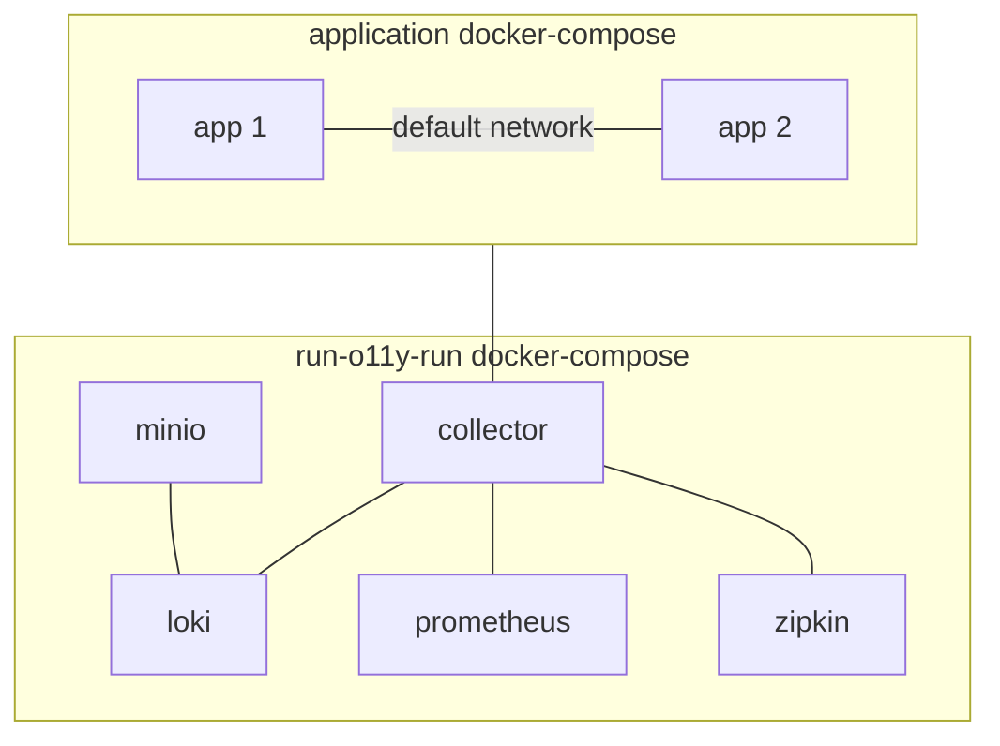

# multi docker-compose setup

In some cases user may want to integrate theirs own `docker-compose` with `run-o11-run`.

To achieve this goal, please run `run-o11y-run` with `--external-network` flag

```sh
run-o11y-run start --external-network 
```

and modify your dockerfile to use `o11y` network. Sample setup may look like:

```yaml
networks:
  o11y:
    name: o11y
    driver: bridge
    external: true

services:
  foo:
    image: ...
    networks:
      - o11y
    environments:
    - OTEL_EXPORTER_OTLP_ENDPOINT: otel-collector:431...

  bar:
    image: ...
    networks:
      - o11y
    environemnts:
    - OTEL_EXPORTER_OTLP_ENDPOINT: otel-collector:431...
```

## Network flow

Customer managed `docker-compose` with `app 1` & `app 2` is connected to `run-o11y-run` assets via `o11y` network which is defined as external.

